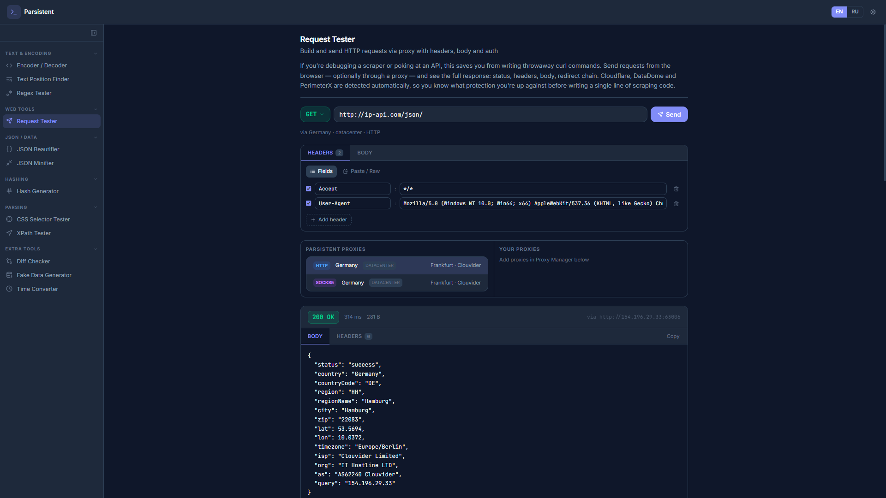

# Parsistent

**Free web parsing toolkit for developers**

🇺🇸 English &nbsp;·&nbsp; [🇷🇺 Русский](#-русский)

---

## 🇺🇸 English

HTTP request tester with proxy support, CSS selector tester, XPath, regex, JSON formatter, diff checker and more — all in one place, straight from the browser.

**→ [parsistent.com](https://parsistent.com)**

### Tools

| Tool | Description |
|------|-------------|
| [Request Tester](https://parsistent.com/tools/request-tester) | Build and send HTTP requests via proxy with headers, body and auth |
| [CSS Selector Tester](https://parsistent.com/tools/css-selector-tester) | Test CSS selectors against HTML snippets |
| [XPath Tester](https://parsistent.com/tools/xpath-tester) | Test XPath expressions against HTML/XML |
| [Regex Tester](https://parsistent.com/tools/regex-tester) | Test regular expressions with match highlighting |
| [JSON Beautifier](https://parsistent.com/tools/json-beautifier) | Format and pretty-print JSON with validation |
| [JSON Minifier](https://parsistent.com/tools/json-minifier) | Minify JSON to a single compact line |
| [Encoder / Decoder](https://parsistent.com/tools/encoder-decoder) | URL, Base64 and HTML entities encode/decode |
| [Hash Generator](https://parsistent.com/tools/hash-generator) | Generate MD5 and SHA-256 hashes from text |
| [Diff Checker](https://parsistent.com/tools/diff-checker) | Compare two texts and highlight differences |
| [Fake Data Generator](https://parsistent.com/tools/fake-data-generator) | Generate random names, emails, phones and addresses |
| [Text Position Finder](https://parsistent.com/tools/text-position) | Find all match positions by index, line and column |
| [Time Converter](https://parsistent.com/tools/time-converter) | Convert Unix timestamps to human-readable dates |

### Features

- 🌐 **Proxy support** — HTTP, HTTPS, SOCKS4, SOCKS5 across all network tools
- 🛡️ **Anti-bot detection** — identifies Cloudflare, DataDome, PerimeterX automatically
- 🔐 **No account required** — all tools work immediately; account will be optional
- ⚡ **Browser-based** — no install, no CLI, no server setup
- 🌍 **English & Russian UI** — full i18n support

### Tech

Next.js 16 · TypeScript · Tailwind CSS v4 · Vercel

| | |
|---|---|
|  |  |

---

## 🇷🇺 Русский

HTTP-тестер запросов с поддержкой прокси, тестер CSS-селекторов, XPath, регулярных выражений, форматировщик JSON, сравнение текстов и многое другое — всё в одном месте, прямо в браузере.

**→ [parsistent.com](https://parsistent.com)**

### Инструменты

| Инструмент | Описание |
|------------|----------|
| [Тестер запросов](https://parsistent.com/ru/tools/request-tester) | Отправка HTTP-запросов через прокси с заголовками, телом и авторизацией |
| [Тестер CSS-селекторов](https://parsistent.com/ru/tools/css-selector-tester) | Тестирование CSS-селекторов на HTML-фрагментах |
| [Тестер XPath](https://parsistent.com/ru/tools/xpath-tester) | Тестирование XPath-выражений на HTML/XML |
| [Тестер регулярных выражений](https://parsistent.com/ru/tools/regex-tester) | Тестирование регулярных выражений с подсветкой совпадений |
| [Форматировщик JSON](https://parsistent.com/ru/tools/json-beautifier) | Форматирование и валидация JSON |
| [Минификатор JSON](https://parsistent.com/ru/tools/json-minifier) | Сжатие JSON в одну компактную строку |
| [Кодировщик / Декодер](https://parsistent.com/ru/tools/encoder-decoder) | Кодирование и декодирование URL, Base64 и HTML-сущностей |
| [Генератор хешей](https://parsistent.com/ru/tools/hash-generator) | Генерация MD5 и SHA-256 хешей из текста |
| [Сравнение текстов](https://parsistent.com/ru/tools/diff-checker) | Сравнение двух текстов с подсветкой различий |
| [Генератор данных](https://parsistent.com/ru/tools/fake-data-generator) | Генерация случайных имён, email, телефонов и адресов |
| [Поиск позиции в тексте](https://parsistent.com/ru/tools/text-position) | Поиск всех вхождений по индексу, строке и столбцу |
| [Конвертер времени](https://parsistent.com/ru/tools/time-converter) | Конвертация Unix-временных меток в читаемый формат |

### Возможности

- 🌐 **Поддержка прокси** — HTTP, HTTPS, SOCKS4, SOCKS5 во всех сетевых инструментах
- 🛡️ **Обнаружение антибот-защит** — автоматически определяет Cloudflare, DataDome, PerimeterX
- 🔐 **Регистрация не обязательна** — все инструменты работают сразу; аккаунт будет опциональным
- ⚡ **Работает в браузере** — ничего не нужно устанавливать
- 🌍 **Интерфейс на русском и английском** — полная поддержка i18n

### Технологии

Next.js 16 · TypeScript · Tailwind CSS v4 · Vercel

| | |
|---|---|
|  |  |

---

*© 2026 Parsistent. Released under the [MIT License](LICENSE).*
